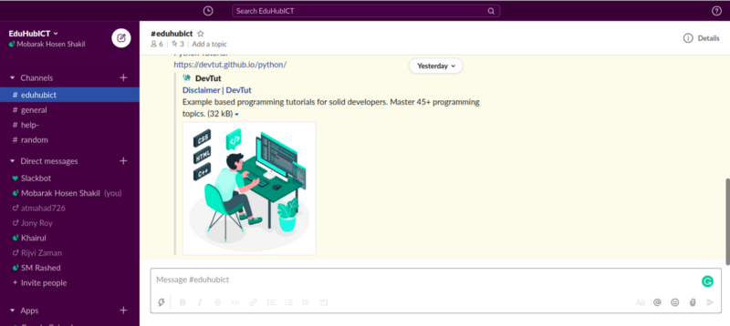
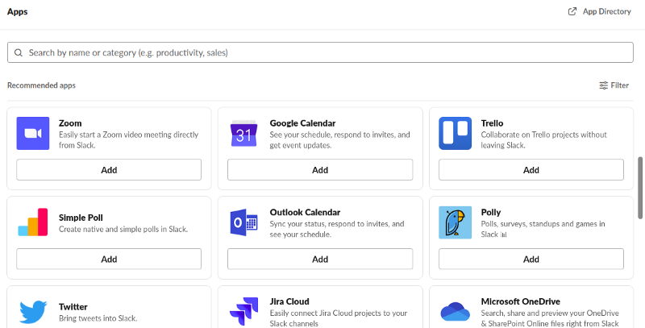
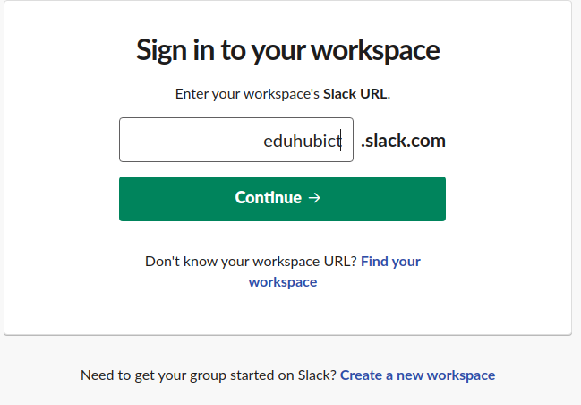
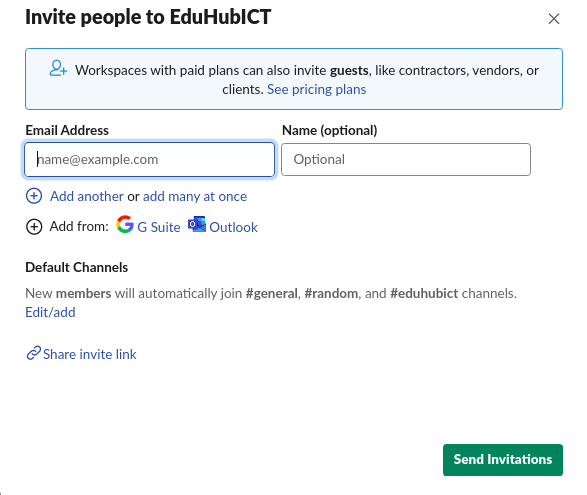
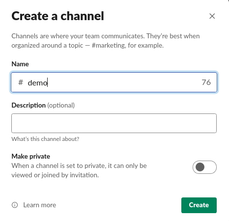

In this article, I’m going to introduce a great workspace messaging platform called “slack” which is used for team collaboration. Slack is a very popular platform in the software industry worth more than 20$ billion value.

What we will know from this article?

*   What is slack?
*   Features of slack
*   Is it for free?
*   Slack installation
*   How to start using slack?

### What is slack?

Slack is a single workplace for messaging, file sharing between team members. It’s designed to support the collaboration with people online as efficiently as we do face-to-face. Slack can be divided mainly into four parts.

1.  Slack workspace name
2.  A number of channels
3.  A number of peoples
4.  Messaging window



To use slack, we have to choose a unique workspace name, this name generates a unique URL to visit the workspace. In the following picture, EduHubICT as the workspace name, and its URL is: [eduhubict.slack.com](http://eduhubict.slack.com)

In slack, teamwork, and communications happen in channels. A channel is a single place for a team to share messages, files, and tools. A channel can be public or private. Private channels can be seen only for invited/ joined members.

In the workspace, we can add people to join the team using their email.

### Features of slack

Slack is an instant messaging system. Besides messaging, slack supports audio-video call and screen sharing to show screen exactly between teammates. It also supports drawing on-screen while sharing with teammates.

Slack supports a lot of apps to connect with the workspace. Those connected apps make it easier to collaborate with teams.



### Is it for free?

Slack can be used for free with a limited edition with 10k searchable messages, 10 apps and integrations, 1-to-1 video calls, and two-factor authentication. you can upgrade your plan if you want from here: [https://app.slack.com/plans](https://app.slack.com/plans)

### Slack Installation

Slack supports almost all devices including, Android, iOS, Windows, Linux, MacBook, etc.  
You can install it in android and iOS from their app store. To download according to your device follow this link: [https://slack.com/downloads](https://slack.com/downloads)

If you are a Linux user and you have the snap store you can quickly install from the terminal using below command:

```
sudo snap install slack --classic
```

### Getting started using slack

If you are a member of an existing workspace, then you can simply sign in using this URL: [https://slack.com/signin](https://slack.com/signin)




or if you want to create a workspace then choose the below option in the above picture or click [here](https://slack.com/create) to create your workspace. After successfully logged in your workspace, you can add/invite people in your team to work together, you can create multiple channels to discuss several topics.

To invite people, click on the workspace name and then choose the invite option:




To create a channel click on the **channel (+) > Create Channel**




Choose the “Make private” option to create a private channel.

I hope this post will help you to start using slack.