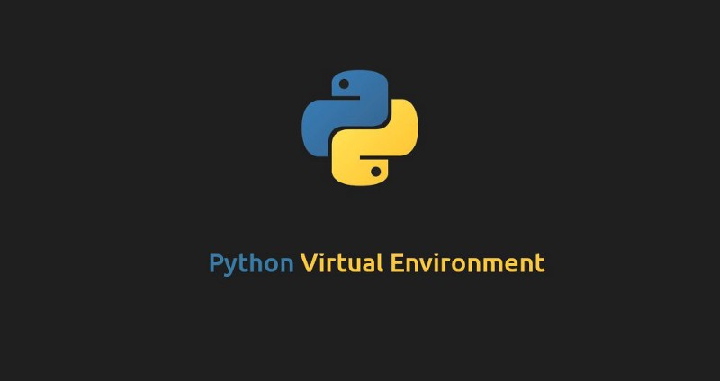
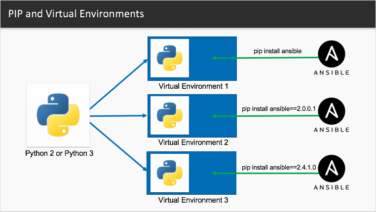
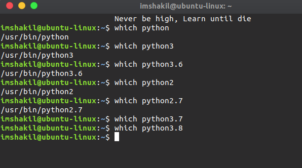

In Python programming, we need an interpreter to compile our python program. We know that python has several versions, commonly `python2.x` and `ptyhon3.x`. To build a python application, we often use third party packages and modules. Each package and module may have several versions in which one version may support `python2.x` whereas another version may support `python3.x`.

This means it may not be possible for one Python installation to meet the requirements of every application. If application A needs version 1.0 of a particular module but application B needs version 2.0, then the requirements are in conflict, and installing either version 1.0 or 2.0 will leave one application unable to run.

The solution for this problem is to create a **virtual environment**, a self-contained directory tree that contains a Python installation for a particular version of Python, plus a number of additional packages.

### Virtual Environment

A virtual environment is a tool that helps to keep dependencies by different projects separate by creating isolated Python virtual environments for them.

Whenever you start working on projects, you can create different virtual environments for each project separately with different python versions. In the above pictures, It’s shown that each virtual environment uses a different version of a module `ansible` . Each environment will be its own virtual space. All packages installed within that space would not interfere with packages outside the environment and will be contained only inside this space.

### Why do we need to use Virtual Environment?

When you install packages and modules, there are few different locations where these packages are installed.

Run below program:

#python3.x

import site  
import sys 

print(sys.prefix)  
print(site.getsitepackages())

You will get an output like below:

/home/imshakil/PythonVenv  
\['/home/imshakil/PythonVenv/lib/python3.6/site-packages', '/home/imshakil/PythonVenv/local/lib/python3.6/dist-packages', '/home/imshakil/PythonVenv/lib/python3/dist-packages', '/home/imshakil/PythonVenv/lib/python3.6/dist-packages', '/usr/lib/python3.6/site-packages', '/usr/local/lib/python3.6/dist-packages', '/usr/lib/python3/dist-packages', '/usr/lib/python3.6/dist-packages'\]

Process finished with exit code 0

Here, the 1st line is the virtual environment directory, others where packages are installed.

By default, every project in your system will use these directories to store and retrieve **site-packages (**third party libraries). It’s not a problem for the **system-packages**(Python standard library), but it must be concerned about the scenario in the above example I have discussed earlier in this article. This is a real problem for Python since it can’t differentiate between versions in the `site-packages` directory. So both v1.0.0 and v2.0.0 would reside in the same directory with the same name

To solve this problem, we just need to create two separate virtual environments for both the projects. The great thing about this is that there are no limits to the number of environments you can have since they’re just directories containing a few scripts.

### Installation Virtual Environment

There are few options to install the virtual environment on your system. Let’s go with the easiest one ‘`venv`’.

#### **Venv**

**Venv** will usually install the latest python version that you have available. If you have several Python versions on your system you can use a specific version, i,e; `python3` or whatever you want. to check available python version on your system following commands in linux:

which python  
which python3.x #   
  

Go to a directory where you want to create a virtual environment and then run the following command:

sudo apt install virtualenv  
sudo apt-get install python3-venv  
python3 -m venv TestVenv

This will create a virtual environment directory as “`TestVenv`” with Python3.

to activate this:

/TestVenv/bin/activate

Virtual Environment should be used whenever you work on any Python-based project. It is generally good to have one new virtual environment for every Python-based project you work on. So the dependencies of every project are isolated from the system and each other.

That’s all for a basic understanding of the virtual environment. I’m still learning about it. I will write more about it later. Thanks.

Reference:

\[1\]. [https://docs.python.org/3/tutorial/venv.html](https://docs.python.org/3/tutorial/venv.html)  
\[2\]. [https://realpython.com/python-virtual-environments-a-primer/](https://realpython.com/python-virtual-environments-a-primer/)  
\[3\]. [https://www.geeksforgeeks.org/python-virtual-environment/](https://www.geeksforgeeks.org/python-virtual-environment/)